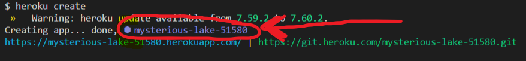
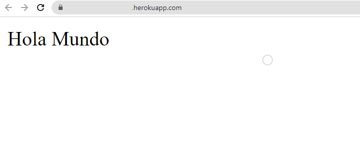

# [Bootcamp Web Developer Full Stack](https://www.thebridge.tech/bootcamps/bootcamp-fullstack-developer/)

### HTML, CSS, JS, ES6, Node.js, Frontend, Backend, Express, React, MERN, testing, DevOps

# DESPLEGAR APLICACIÓN NodeJs DOCKER EN HEROKU

Para desplegar aplicación básica de nodejs en heroku seguimos los siguientes pasos.Creamos un proyeto de nodejs

```js
npm init -y
```
Instalamos **express** 
```js
npm i express
```
Creamos archivo de servidor **app.js** con el siguiente contenido

```js
const express =require("express")
 
const app = express()
const port = process.env.PORT

app.use(express.json())
 
app.use("/",(req,res)=>{
    res.send("Hola Mundo" )
})

app.listen(port,console.log(port))
```
Modificamos archivo **package.json** agregando la instrucción **start**:

```js
 {
  "name": "docker-local",
  "version": "1.0.0",
  "description": "",
  "main": "index.js",
  "scripts": {
    "test": "echo \"Error: no test specified\" && exit 1",
    "start": "node app.js"
  },
  "keywords": [],
  "author": "",
  "license": "ISC",
  "dependencies": {
    "express": "^4.18.1"
  }
}

```

Creamos archivo **Dockerfile** con el siguiente contenido:

```Dockerfile 
FROM node:18.2.0-alpine3.14

WORKDIR /app

COPY package.json .

RUN npm install

COPY app.js .

CMD ["npm", "start"]
 
```

## COMANDOS HEROKU

Primero hacemos login en heroku con el siguiente comando

```

heroku login
```

Acontinuación hacemos un segundo login en heroku con el siguiente comando

```

heroku container:login
```
 
Creamos una aplicación de **heroku**.
- Importante 
copiamos el nombre de la apliación que se nos genere , porque más adelante nos hará falta

```

heroku create
```
Ejemplo: 



 
A continuación desplegamos nuestra app a heroku 

```
heroku container:push web -a nombre_de_la_app
```

Después para activar el contenedor y que se muestre nuestra aplicación usamos el siguiente comando 
```
heroku container:release web -a nombre_de_la_app  
```

Para finalizar entrar en vuestra aplicación de heroku y os saldrá esto 

